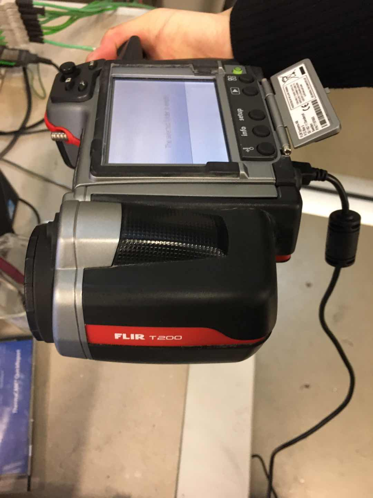
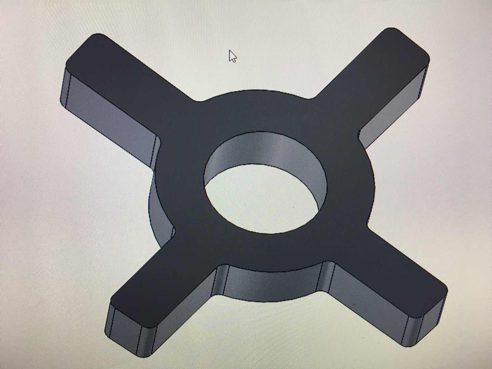
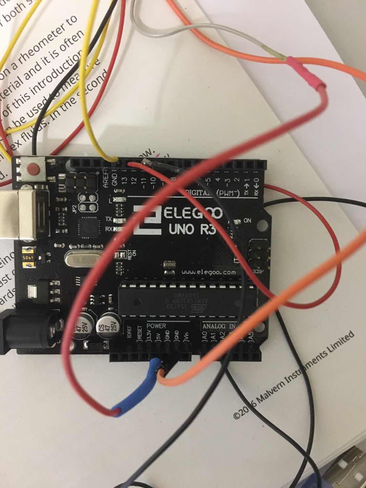

# Engineer
**Text: Alicia**  
**Picture: Alicia**  

> An engineer refers to a person who has the ability to operate, design, manage, and evaluate engineering systems.

_2021.03.18_
> In the field of engineering and technology, the proportion of female engineers is much smaller than that of men, which is a problem of globalization.

#### My childhood dream
I have been interested in mathematics and physics since I was a child, because they are ways to explore the essence of matter.  When I was young, I liked to solve the problems of logical thinking and spatial imagination.
When I took an airplane for the first time, I was curious why the airplane can fly in the air, why it can rise and fall, and why it can fly at a certain speed.
Over time, my childhood dream was to become a scientist or engineer.

#### My major in University
In order to learn how to design and manufacture mechanical equipment and related knowledge of engineering mechanics, I chose mechanical engineering.

#### My works as an engineer

Here is a thermal imaging camera (infrared camera) used for measure the object temperature.

Here is SolidWorks 3D design which is widely used in industries.

Here is a basic thermal couple that can be used for measure points temperature on an object.

## Engineers can add color to the world!
