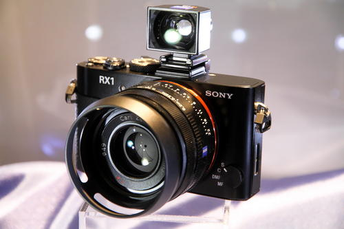
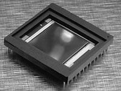

# Engineer
**Text: Alicia**  
**Picture: Alicia**  

> An engineer refers to a person who has the ability to operate, design, manage, and evaluate engineering systems.

_2021.03.18_
> In the field of engineering and technology, the proportion of female engineers is much smaller than that of men, which is a problem of globalization.

> Image source: http://info.xitek.com/slide/201209/19-101726_2.html

#### What is sensing technology?
In the development of modern science and engineering, sensing technology is a very important research field and has a very wide range of applications. Today's society is an information age. We know that the generation, acquisition, storage, transmission, processing and application of information are the six major components of modern information science. Among them, we generally use sensor technology to obtain information from natural information sources, and to recognize, process and convert it to make it the information that can be displayed by the computer.
The sensor can perceive the surrounding environment, such as temperature, ultraviolet rays, material form, color, gas, humidity, etc., recognize it as an analog signal, and then convert it into a digital signal, so that the computer can recognize it, and convert it into temperature and humidity parameters through the central processing unit , Shape and size parameters, color parameters, light intensity parameters, etc., which can be expressed intuitively.

#### What are the uses of image sensors?
Image sensor is a functional type of many sensors, mainly used for the recognition and processing of environmental imaging. There are many common image sensors in life, such as digital cameras, rearview cameras, etc. With the development of digital products, the pixels of digital cameras commonly used in our lives are gradually increasing, from hundreds of thousands of pixels in the past to millions of pixels now.
In industrial production and scientific research, we often use image sensors to measure faster substances. For example, we often use high-speed cameras to measure the trajectory and speed of particles in gases, liquids and solids.

#### What are the types of image sensors?
Image sensors currently used are mainly divided into CCD (charge coupled device image sensor), CMOS (complementary metal oxide semiconductor image sensor) and CIS (contact image sensor), of which CCD and CMOS are the most commonly used. CCD sensor is a kind of image sensor developed earlier, and CMOS sensor is a technology with a number of superior performance developed at the beginning of this century.

#### How does the image sensor work?
The CCD sensor is actually an integrated circuit that contains a set of capacitors connected or coupled to each other. Under the control of an external circuit, each capacitor can transfer its charge to an adjacent capacitor. It is mainly composed of a photosensitive unit, an input structure and an output structure, and stores the light signal in the form of electric charge. Then apply a certain pulse to the stored charge to make it do directional transmission, and finally convert it into a digital signal through the analog-to-digital converter chip and transmit it to the computer. Eventually it becomes data that our computer can read and display.
The manufacturing technology of CMOS sensors mainly uses semiconductors made of two elements: silicon and germanium, so that N-level and P-level semiconductors coexist on complementary metal oxides. The current generated by these two complementary processes can be recorded by the chip, and translated into images.

#### So, what are the advantages and disadvantages of CCD sensors and CMOS sensors?
Advantages: (1) The CCD sensor can capture images with low noise; (2) The CMOS sensor captures a line of signals at regular intervals, which may produce a "rolling shutter" effect, which makes the image imaging slightly inclined, but the CCD sensor uses The frame transmission process works without "rolling shutter".
Disadvantages: (1) CCD sensors consume more power than CMOS sensors; (2) have a certain image lag effect; (3) manufacturing costs are usually higher than CMOS sensors; (4) CMOS sensors have better halo control Ability; (5) The sensitivity of CMOS sensors is usually higher.
In your daily life, you can also choose digital cameras with different types of image sensors according to different needs.

#### Prospects
In industrial production, we currently prefer CMOS sensors because they are more suitable for high-speed cameras. But in fact, the measurement field of mechanical engineering still needs image sensors with better performance. For example, in the measurement of experimental fluid mechanics and solid mechanics, we often use laser particle image velocimetry. The particles may have very large velocities, which requires a lot of High sensitivity, low noise and high image resolution. Therefore, for the current booming sensor technology, the research of image sensors still faces many problems. 

