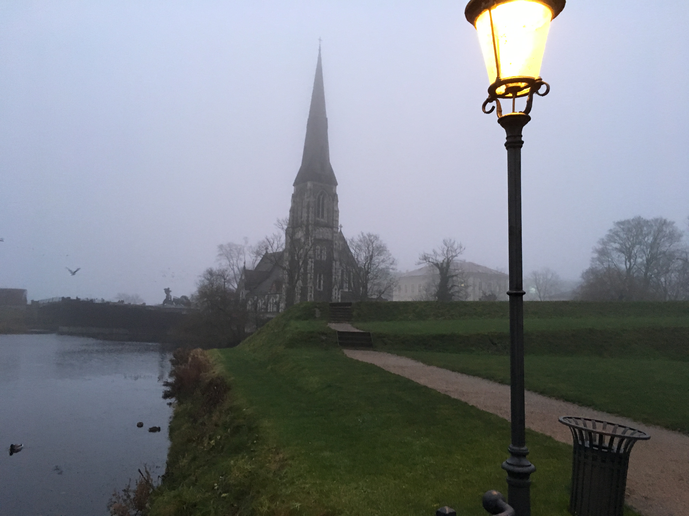
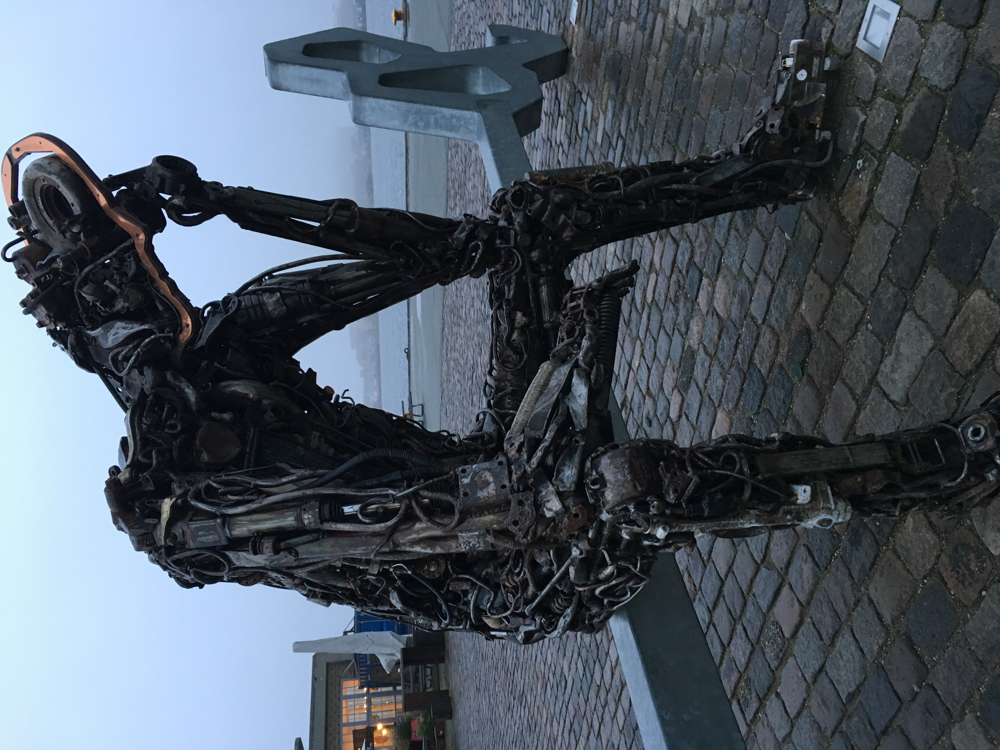

# Merry Christmas
**Text: Alicia**  
**Picture: Alicia**  

> Denmark, a magical fairy tale kingdom!

_2021.03.18_
> On Christmas 2019, I came to Denmark, which I have always wanted to visit.
Copenhagen is also one of the European cities I want to visit most. Here, the little mermaid statue can be regarded as Copenhagen's business card.

#### Early morning in Copenhagen
Nice view of Kastellet

#### The gate of Kastellet Park
A park in the shape of a five-pointed star. There are very few people here in theearly morning, and only some local residents running here.

#### Sculpture near the park
Denmark is a country that pays great attention to environmental protection. Such sculptures are made of waste metal materials, which also convey the environmental protection concept of waste utilization.

#### The nice view of Langelinie Pavillonen

#### Finally! Came to the Little Mermaid's side

#### Do you know there is another little mermaid?
It is the Genetically Modified Little Mermaid by Björn Nörgaard. Its form is relatively abstract, but full of artistic sense. It is not far from the Little Mermaid statue, don't miss it!

